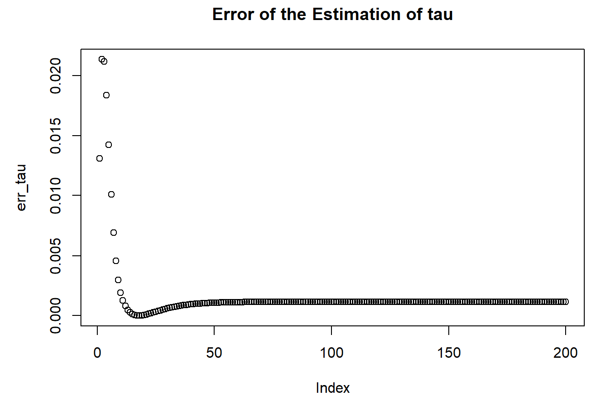
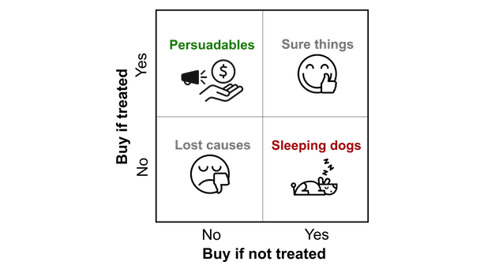

# AGENTS.md - AI Agent Project Guide

> 本项目为周臻（Zhen Zhou）的个人学术博客网站，使用 GitHub Pages 托管。
> 
> 网站地址：https://zhenz2020.github.io/

---

## 1. 项目概述 (Project Overview)

这是一个**静态个人博客网站**，用于记录和分享机器学习、统计学、因果推断等领域的学习心得、算法实现和项目实践。网站主人周臻是统计与计算机专业的研究生，本科为计算数学专业。

### 1.1 核心定位
- **类型**: 个人学术博客 / 技术笔记
- **受众**: 统计学、机器学习学习者
- **语言**: 主要为中文，部分专业术语使用英文
- **托管平台**: GitHub Pages

### 1.2 主要内容领域
| 领域 | 说明 |
|------|------|
| 统计学习 | Lasso、岭回归、交叉验证、EM算法、MCMC等 |
| 机器学习 | KNN、K-means、多项式回归、强化学习等 |
| 因果推断 | Causal Inference、Propensity Score、Causal Forests |
| 深度学习 | Diffusion Model 理论推导 |
| 实际应用 | 股价预测、房价预测、影评情感分析、供应链优化 |
| 算法实现 | R语言和Python的算法复现与对比 |

---

## 2. 技术栈 (Technology Stack)

### 2.1 网站构建
| 组件 | 技术/工具 | 说明 |
|------|-----------|------|
| 静态站点生成 | Jekyll | GitHub Pages 默认使用 |
| 主题 | jekyll-theme-cayman | 配置于 `_config.yml` |
| 托管 | GitHub Pages | 仓库名即为站点域名 |

### 2.2 前端技术
| 组件 | 来源/版本 | 用途 |
|------|-----------|------|
| CSS框架 | W3.CSS 4 | 响应式布局核心框架 |
| 字体 | Google Fonts - Raleway | 全站字体 |
| 图标 | Font Awesome 6.4.0 | 侧边栏和按钮图标 |
| JavaScript | 原生JS | 主题切换、搜索筛选、动画交互 |

### 2.3 新特性 (2024年更新)
| 特性 | 说明 |
|------|------|
| 暗色模式 | 支持亮色/暗色主题切换，自动保存偏好 |
| 文章搜索 | 实时搜索文章标题、内容和标签 |
| 分类筛选 | 按统计/应用/基础/闲话分类筛选 |
| 网格布局 | 响应式卡片网格布局替代传统列表 |
| 平滑动画 | 滚动动画、悬停效果、页面过渡 |

### 2.4 数据科学与编程
| 语言 | 用途 |
|------|------|
| **R** | 统计建模、算法实现、数据可视化 |
| **Python** | 机器学习、深度学习、基础教学 |
| **MATLAB** | 排队论模拟、数值计算 |

---

## 3. 项目结构 (Project Structure)

### 3.1 优化后的文件夹结构

```
Zhenz2020.github.io/
├── index.html                    # 🏠 主页（全新设计）
├── _config.yml                   # Jekyll 配置文件
├── README.md                     # 项目说明
├── AGENTS.md                     # 本文件
│
├── 【分类索引页面】
│   ├── index_statistics.html     # 统计学习分类
│   ├── index_application.html    # 实际应用分类
│   ├── index_thinking.html       # 闲话随笔分类
│   └── index_fundamental.html    # 基础教学分类
│
├── 【文章页面 - HTML格式】
│   ├── ARMA.html                 # 时间序列与Gauss-Newton算法
│   ├── MH_algorithm.html         # Metropolis-Hastings算法
│   ├── Gradient_descent.html     # 梯度下降方法
│   ├── group_lasso.html          # Group Lasso实现
│   ├── LOO-CV_GCV.html           # 交叉验证方法
│   ├── NCS-kmeans.html           # 时间序列聚类
│   ├── text2vector.html          # 文本情感分析
│   ├── House_price.html          # 房价预测
│   ├── dice_game.html            # 大话骰Web App
│   ├── DICE_DRINK.html           # 大话骰游戏辅助
│   ├── stat510-hw3.html          # EM算法
│   ├── Assignment_1_4358_zhenz5_ZhenZhou.html  # KNN模型
│   ├── Assignment_2_4358_zhenz5_ZhenZhou.html  # Lasso回归
│   ├── 相关性分析与线性回归.html  # Python基础教学1
│   ├── 多项式回归.html            # Python基础教学2
│   └── 瞎想.html                  # 个人思考
│
├── assets/                       # 📁 静态资源（新结构）
│   ├── css/                      # 样式表
│   ├── js/                       # JavaScript文件
│   ├── sass/                     # Sass源文件
│   ├── webfonts/                 # 字体文件
│   │
│   ├── images/                   # 🖼️ 图片资源
│   │   ├── covers/               # 文章封面图
│   │   │   ├── EM-cover.png
│   │   │   ├── KNN-cover.png
│   │   │   ├── Lasso-cover.png
│   │   │   ├── linear-cover.png
│   │   │   ├── LOO-CV.png
│   │   │   ├── MH.png
│   │   │   ├── NCS-cover.png
│   │   │   ├── GD.png
│   │   │   ├── GN.png
│   │   │   ├── group-lasso.png
│   │   │   ├── house_price.png
│   │   │   ├── causal_lanechange.png
│   │   │   ├── lambda_plot.png
│   │   │   ├── paper1-cover.png
│   │   │   ├── 多项式-cover.png
│   │   │   ├── lasso-three.png
│   │   │   ├── dice_game_pic.png
│   │   │   └── covid.png
│   │   │
│   │   ├── profile/              # 👤 个人资料图片
│   │   │   ├── avatar.jpg        # 头像 (原636234904815227418.jpg)
│   │   │   ├── ME.jpg
│   │   │   ├── INWUT.jpg         # 武汉理工大学
│   │   │   ├── INUIUC.jpg        # UIUC照片
│   │   │   ├── moon.jpg          # 背景图
│   │   │   ├── xiaowu.jpg
│   │   │   ├── shaizi.jpg
│   │   │   └── ...
│   │   │
│   │   └── projects/             # 📊 项目相关图片
│   │       ├── causal_uplift.png
│   │       ├── gatech_td.png
│   │       ├── ml4t_strategy.png
│   │       ├── diffusion_process.png
│   │       └── huawei_supply_chain.png
│   │
│   ├── docs/                     # 📄 文档/PDF
│   │   ├── papers/               # 学术论文
│   │   │   ├── maunscript_final.pdf
│   │   │   ├── lane_change_using_other_dataset.pdf
│   │   │   └── My-paper.pdf
│   │   │
│   │   ├── projects/             # 项目文档
│   │   │   ├── causal_estimation.pdf
│   │   │   ├── td_lambda_report.pdf
│   │   │   ├── strategy_eval_report.pdf
│   │   │   ├── huawei_supply_chain.pdf
│   │   │   ├── Lasso-three-methods.pdf
│   │   │   └── covid.pdf
│   │   │
│   │   └── cv/                   # 简历
│   │       ├── Zhen Zhou CV-20230501.pdf
│   │       ├── Zhen Zhou CV-0923.pdf
│   │       └── Zhen Zhou CV中文-0923.pdf
│   │
│   └── data/                     # 📊 数据文件
│       ├── Data_eco.csv
│       └── Data_LOOCV.csv
│
├── 【项目子目录】
│   ├── Causal/                   # 因果推断相关
│   │   ├── Causal Estimation.pdf
│   │   └── uplift.png
│   ├── Diffusion_model/          # 扩散模型
│   │   ├── DF_overview.html
│   │   └── diffusion_process.png
│   ├── Gatech_CS/                # 佐治亚理工课程项目
│   │   ├── TD_report.pdf
│   │   └── TD.png
│   ├── huawei/                   # 华为供应链项目
│   │   ├── 供应链交流会0803_20230910145916.pdf
│   │   └── 图片1.png
│   └── ml4t/                     # Machine Learning for Trading
│       ├── strategyEval_report.pdf
│       └── Manual_Strategy_out.png
│
└── 【其他文件】
    ├── DL.ipynb                  # 深度学习笔记本
    ├── Stat480_project.ipynb     # 统计项目
    ├── Zhen Zhou CV*.docx        # 简历Word版本
    └── Thesis_Ren.htm            # 论文相关
```

### 3.2 根目录下保留的原始文件
以下文件仍保留在根目录，以保证旧链接的兼容性：
- 所有 `*.html` 文章页面
- 原始图片文件（建议后续清理）
- 原始PDF文件（建议后续清理）
- 项目子目录（建议后续迁移）

---

## 4. 内容组织与分类 (Content Organization)

### 4.1 分类说明

| 分类 | 页面文件 | 图标 | 内容特点 |
|------|----------|------|----------|
| **全部** | `index.html` | - | 所有文章按时间倒序排列 |
| **统计** | `index_statistics.html` | fa-graduation-cap | 统计学习方法、理论推导、算法实现 |
| **应用** | `index_application.html` | fa-laptop | 实际项目、案例分析、端到端应用 |
| **闲话** | `index_thinking.html` | fa-tree | 个人思考、随笔 |
| **基础** | `index_fundamental.html` | fa-book | Python/R基础教学、入门教程 |

### 4.2 新主页特性

#### Hero 区域
- 全屏展示博客主题和简介
- 统计数字展示（文章数、分类数、经验年数）
- 渐变文字效果和装饰性背景

#### 搜索与筛选
- 实时搜索：支持标题、内容、标签搜索
- 分类筛选：一键筛选统计/应用/基础/闲话分类
- 无结果提示：友好提示用户调整搜索条件

#### 文章卡片
- 响应式网格布局
- 悬停动画效果
- 分类标签和日期显示
- 标签云展示

#### 主题切换
- 亮色/暗色模式一键切换
- 自动保存用户偏好到 localStorage
- 平滑的颜色过渡动画

---

## 5. 页面模板与样式 (Templates & Styling)

### 5.1 CSS 变量系统

```css
:root {
  --primary-color: #1a5276;
  --secondary-color: #2ecc71;
  --bg-primary: #ffffff;
  --bg-secondary: #f8f9fa;
  --text-primary: #2c3e50;
  --text-secondary: #5d6d7e;
  --shadow-md: 0 4px 12px rgba(0,0,0,0.1);
  --transition: all 0.3s cubic-bezier(0.4, 0, 0.2, 1);
}

[data-theme="dark"] {
  --bg-primary: #1a1a2e;
  --bg-secondary: #16213e;
  --text-primary: #eaecee;
  /* ... */
}
```

### 5.2 响应式断点

| 断点 | 宽度 | 布局变化 |
|------|------|----------|
| 桌面 | > 1024px | 双列Hero，三列联系卡片 |
| 平板 | 768px - 1024px | 单列Hero，双列联系卡片 |
| 手机 | < 768px | 单列布局，隐藏导航链接 |

### 5.3 动画效果

| 效果 | 实现方式 | 用途 |
|------|----------|------|
| fadeInUp | CSS Animation | 页面加载动画 |
| 悬停上浮 | transform + transition | 卡片交互反馈 |
| 主题切换 | CSS Variables | 亮色/暗色切换 |
| 平滑滚动 | scroll-behavior | 锚点导航 |

---

## 6. 开发约定 (Development Conventions)

### 6.1 文件命名规范

| 类型 | 命名模式 | 示例 |
|------|----------|------|
| 文章HTML | 英文描述.html / 中文描述.html | `ARMA.html`, `梯度下降.html` |
| 课程作业 | Assignment_编号_学号_姓名.html | `Assignment_1_4358_zhenz5_ZhenZhou.html` |
| 封面图片 | 主题-cover.png | `EM-cover.png`, `KNN-cover.png` |
| 项目图片 | 项目名_描述.png | `causal_uplift.png` |
| 个人图片 | 描述.jpg | `avatar.jpg`, `INWUT.jpg` |
| PDF文档 | 描述.pdf | `cv_en.pdf`, `paper_causal.pdf` |

### 6.2 资源引用规范

**新资源路径（推荐）:**
```html
<!-- 头像 -->


<!-- 文章封面 -->


<!-- 项目图片 -->


<!-- PDF文档 -->
<a href="assets/docs/papers/My-paper.pdf">

<!-- 数据文件 -->
<a href="assets/data/Data_eco.csv">
```

### 6.3 文章卡片数据结构

```html
<article class="post-card" data-category="statistics" data-tags="Lasso,优化,R语言">
  <div class="post-image">
    
    <span class="post-category">统计学习</span>
  </div>
  <div class="post-content">
    <div class="post-date">YYYY-MM-DD</div>
    <h3 class="post-title"><a href="文章链接.html">标题</a></h3>
    <p class="post-excerpt">文章摘要...</p>
    <div class="post-tags">
      <span class="post-tag">标签1</span>
      <span class="post-tag">标签2</span>
    </div>
  </div>
</article>
```

---

## 7. 部署与发布 (Deployment)

### 7.1 GitHub Pages 部署
- **分支**: `main` 分支自动部署
- **构建**: GitHub 自动使用 Jekyll 构建
- **域名**: `https://zhenz2020.github.io/`
- **自定义域名**: 未配置

### 7.2 发布流程
1. 编辑或创建HTML文件
2. 添加/更新资源到 `assets/` 目录
3. 更新相关分类的索引页面
4. 提交并推送至GitHub:
   ```bash
   git add .
   git commit -m "添加文章：XXX"
   git push origin main
   ```
5. 等待GitHub Pages自动构建（通常1-2分钟）

### 7.3 本地预览
由于新主页使用纯HTML/CSS/JS，可直接在浏览器打开：
```bash
# 使用Python简易HTTP服务器
python -m http.server 8000

# 或使用Node.js的http-server
npx http-server -p 8000
```

---

## 8. 迁移说明 (Migration Notes)

### 8.1 已完成迁移
- ✅ 创建新的 `assets/` 目录结构
- ✅ 迁移封面图片到 `assets/images/covers/`
- ✅ 迁移个人图片到 `assets/images/profile/`
- ✅ 迁移项目图片到 `assets/images/projects/`
- ✅ 迁移PDF文档到 `assets/docs/`
- ✅ 迁移数据文件到 `assets/data/`
- ✅ 创建新版 `index.html`

### 8.2 待完成迁移
- ⏳ 更新 `index_statistics.html` 使用新路径
- ⏳ 更新 `index_application.html` 使用新路径
- ⏳ 更新 `index_thinking.html` 使用新路径
- ⏳ 更新 `index_fundamental.html` 使用新路径
- ⏳ 清理根目录下的重复文件
- ⏳ 迁移项目子目录中的文件到 `assets/`

### 8.3 旧路径兼容性
为保证旧链接不失效，原始文件在根目录下保留，建议：
1. 逐步更新所有HTML页面使用新路径
2. 测试所有链接正常工作
3. 确认无误后可删除根目录下的重复文件

---

## 9. 注意事项 (Important Notes)

### 9.1 编码问题
- 所有HTML文件必须使用 **UTF-8** 编码
- 文件头部必须包含: `<meta charset="UTF-8">`
- 中文文件名需确保URL编码正确

### 9.2 外部依赖
- W3.CSS、Google Fonts、Font Awesome 通过CDN引入
- 需要网络连接才能正常显示样式
- 建议定期检查CDN可用性

### 9.3 性能优化建议
- 图片建议使用WebP格式并添加懒加载
- 考虑使用CDN加速静态资源
- 大文件（PDF、数据）建议添加下载提示

### 9.4 SEO优化
- 每篇文章添加meta description
- 使用语义化HTML标签
- 添加Open Graph标签支持社交媒体分享

---

## 10. 联系信息

| 项目 | 内容 |
|------|------|
| 作者 | 周臻 (Zhen Zhou) |
| GitHub | https://github.com/Zhenz2020 |
| 邮箱 | zhenz5@illinois.edu / zhouzhen20210601@163.com |
| LinkedIn | https://www.linkedin.com/in/臻-周-7385b2219/ |

---

## 11. 更新日志

### 2024-02-28
- 🎨 全新主页设计：现代化UI、暗色模式、搜索筛选
- 📁 重构文件结构：所有附件迁移到 `assets/` 目录
- 🏷️ 添加文章标签系统和分类筛选
- 📱 优化移动端响应式体验
- ⚡ 添加平滑动画和交互效果

---

*最后更新: 2024-02-28*
